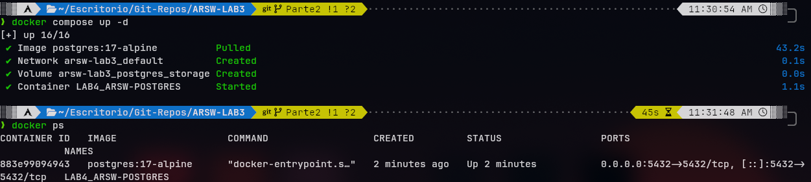
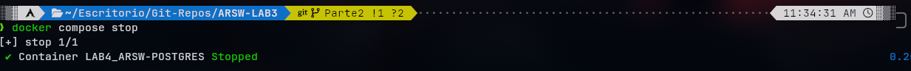

# Mini-Doc: Desarrollo del Laboratorio

--- 

## 1) Familiarización con el código base

- Para esta parte primeramente revisamos el paquete de `model`, encontramos dos clases, `Blueprint` y `Point`.
  - En `Blueprint` nos damos cuenta de que es clase es un módelo que representa un plano digital compuesto por 
  autor, nombre identificador, y una secuencia de puntos o coordenadas. 
  - Además de esto tiene las siguientes características: 
    - Identificación del plano: Almacena el creador (`author`) y el título del plano (`name`).
    - Manejo de coordenadas: Mantiene una lista interna de objetos `Point (points)`. Permite inicializarla desde el constructor o agregar puntos individuales mediante `addPoint(Point p)`.
    - Encapsulamiento e inmutabilidad parcial: El método `getPoints()` retorna `Collections.unmodifiableList(points)`, lo que impide que agentes externos modifiquen la lista directamente sin usar los métodos de la clase.
    - Identidad e igualdad (`equals y hashCode`): Dos instancias de Blueprint se consideran equivalentes si coinciden exactamente en su autor y nombre, independientemente de los puntos que contengan. Esto permite usar el par (`author, name`) como clave única en estructuras como `HashSet` o `HashMap`.

  - En `Point` se encuentra es un `record`, representando coordenadas bidimensionales `(x, y)`.
    - Contiene lo siguiente: 
      - Campos inmutables: Dos atributos privados y finales `(private final int x, private final int y)`.
      - Constructor canónico: `public Point(int x, int y)` para inicializar ambos valores.
      - Getters de lectura: Métodos de acceso `x()` e `y()`.
      - Comparación por valor `(equals y hashCode)`: Dos puntos se consideran idénticos si sus valores x e y coinciden, permitiendo comparaciones directas y su uso seguro en colecciones.
      - Representación textual (toString): Devuelve una cadena legible con el formato `Point[x=..., y=...]`.

- Seguido de `model`, revisamos la carpeta de `persistence` y encontramos dos clases de excepciones, una interfaz y una clase.

    - En `BlueprintNotFoundException` y `BlueprintPersistenceException`:

        - Son clases de excepción personalizadas que extienden de `Exception` (excepciones verificadas o *checked exceptions*).

        - `BlueprintNotFoundException`: Se dispara cuando se solicita un plano o un autor que no existe en el repositorio.

        - `BlueprintPersistenceException`: Se dispara cuando ocurre un error al registrar o procesar un plano (por ejemplo, intentar guardar un plano que ya existe).

    - En `BlueprintPersistence`:

        - Es la interfaz que define el contrato para el almacenamiento y consulta de planos, permitiendo desacoplar la lógica de negocio del mecanismo de almacenamiento concreto.

        - Define operaciones para: guardar un plano (`saveBlueprint`), consultar un plano por autor y nombre (`getBlueprint`), consultar todos los planos de un autor (`getBlueprintsByAuthor`), obtener todos los planos registrados (`getAllBlueprints`) y agregar puntos a un plano existente (`addPoint`).

    - En `InMemoryBlueprintPersistence`:

        - Es la implementación en memoria de `BlueprintPersistence`, anotada con `@Repository` para ser gestionada como un bean por el contenedor de inversión de control de Spring.

        - **Almacenamiento concurrente:** Utiliza un `ConcurrentHashMap<String, Blueprint>` donde la llave se forma concatenando `author:name`, garantizando operaciones seguras en entornos multihilo.

        - **Carga inicial:** En su constructor precarga datos de prueba con tres planos predefinidos (`bp1`, `bp2`, `bp3`).

        - **Lógica de persistencia y consulta:** Valida la existencia de elementos antes de insertar o retornar datos, lanzando las excepciones `BlueprintPersistenceException` o `BlueprintNotFoundException` según corresponda, y utiliza flujos (`Streams`) para filtrar planos por autor.

- Continuamos con el paquete de `services`, donde encontramos la clase de servicio principal del sistema.

    - En `BlueprintsServices`:

        - Es la clase que encapsula la lógica de negocio de la aplicación, anotada con `@Service` para que Spring la gestione como un bean de servicio e inyecte automáticamente sus dependencias mediante constructor.

        - **Inyección de dependencias:** Recibe una implementación de la interfaz `BlueprintPersistence` (para el acceso a datos) y una de `BlueprintsFilter` (para aplicar transformaciones o filtros sobre los puntos del plano).

        - **Operaciones principales:**

            - **Registro de planos:** El método `addNewBlueprint(Blueprint bp)` delega el guardado a la capa de persistencia, propagando `BlueprintPersistenceException` si ya existe.

            - **Consultas:** Permite obtener todos los planos (`getAllBlueprints`) o los de un autor en específico (`getBlueprintsByAuthor`), propagando `BlueprintNotFoundException` si el autor no tiene registros asociados.

            - **Consulta con filtrado:** El método `getBlueprint(String author, String name)` recupera el plano desde la persistencia y le aplica la estrategia de procesamiento definida en `filter.apply(...)` antes de retornarlo.

            - **Modificación de coordenadas:** Permite añadir nuevos puntos a un plano existente (`addPoint`) delegando la operación directamente a la persistencia.
  
---

## 2) Migración a persistencia en PostgreSQL

- Para esto creamos el archivo de `compose.yaml` de esta forma:

```yaml
services:
  db:
    image: postgres:17-alpine
    container_name: LAB4_ARSW-POSTGRES
    environment:
      POSTGRES_DB: lab4_arsw
      POSTGRES_USER: postgres
      POSTGRES_PASSWORD: chefai?
    ports:
      - "5432:5432"
    volumes:
      - postgres_storage:/var/lib/postgresql/data
volumes: 
  postgres_storage:
```

**Nota**: Al ser una base de datos local, no hay problema con dar la clave en él `compose.yaml`, sin embargo, en un ambiente real no es lo esperado.

Y también él `init.sql` con el siguiente contenido:

```sql
CREATE TABLE IF NOT EXISTS blueprints (
    author VARCHAR(100) NOT NULL,
    name VARCHAR(100) NOT NULL,
    PRIMARY KEY (author, name)
);

CREATE TABLE IF NOT EXISTS points(
    id SERIAL PRIMARY KEY,
    author VARCHAR(100) NOT NULL,
    blueprint_name VARCHAR(100) NOT NULL,
    x INT NOT NULL,
    y INT NOT NULL,
    point_order INT NOT NULL,
    FOREIGN KEY (author, blueprint_name) REFERENCES blueprints(author, name) ON DELETE CASCADE
);
```

##### También se debe modificar él `pom.xml`, le agregamos lo siguiente: 

```xml
<dependency>
    <groupId>org.springframework.boot</groupId>
    <artifactId>spring-boot-starter-jdbc</artifactId>
</dependency>
<dependency>
    <groupId>org.postgresql</groupId>
    <artifactId>postgresql</artifactId>
    <scope>runtime</scope>
</dependency>
```

##### Se debe modificar el archivo `application.yaml` con lo siguiente:

```yaml 
spring:
  application:
    name: SpringBoot_REST_API_Blueprints
  mvc:
    pathmatch:
      matching-strategy: ant_path_matcher
  datasource:
    url: jdbc:postgresql://localhost:5432/lab4_arsw
    username: postgres
    password: chefai?
    driver-class-name: org.postgresql.Driver

springdoc:
  swagger-ui:
    path: /swagger-ui.html
```

#### Finalmente, para ejecutarlo, ejecutamos: 

1. Levantar los servicios en segundo plano:

   ```bash
   docker compose up -d
   ```

2. Verificar que los contenedores estén ejecutándose:

   ```bash
   docker ps
   ```
3. Parar el contenedor:

   ```bash
   docker compose stop 
   ```
##### Debería salir de la siguiente forma: 

###### Docker corriendo:



###### Docker parado: 



### Implementación de `PostgresBluePrintPersistence`:

- Para esto lo que decidimos hacer fue crear un nuevo repositorio Spring Data JPA, `BlueprintJpaRepository`, que extiende de `JpaRepository<Blueprint, BlueprintPK>` y añade el método derivado `findByAuthor(String author)` para consultar todos los planos de un autor.

- Para que Spring Data pudiera gestionar `Blueprint` como entidad, la convertimos en una entidad JPA:
  - Se anotó con `@Entity` y `@Table(name = "blueprints")`.
  - Como la clave primaria es compuesta (`author` + `name`), se usó `@IdClass(BlueprintPK.class)`, marcando ambos campos con `@Id`. `BlueprintPK` es una clase auxiliar que implementa `equals`/`hashCode` sobre esos dos campos, tal como lo exige JPA para claves compuestas.
  - La lista de `points` se mapeó como una colección de elementos embebidos con `@ElementCollection(fetch = FetchType.EAGER)`, `@CollectionTable(name = "points", ...)` (uniendo por `author` y `name` del blueprint) y `@OrderColumn(name = "point_order")` para conservar el orden de inserción de los puntos, ya que por defecto una colección JPA no garantiza orden.

- Con la entidad lista, `PostgresBlueprintPersistence` implementa la misma interfaz `BlueprintPersistence` que usaba la versión en memoria (manteniendo el contrato), delegando cada operación al `BlueprintJpaRepository`:
  - `saveBlueprint`: primero verifica con `existsById` si ya existe un plano con esa clave, y si es así lanza `BlueprintPersistenceException`; si no, lo guarda con `repository.save(bp)`.
  - `getBlueprint`: usa `findById` con el `BlueprintPK` y lanza `BlueprintNotFoundException` si no lo encuentra (`orElseThrow`).
  - `getBlueprintsByAuthor`: usa el método derivado `findByAuthor`, lanzando `BlueprintNotFoundException` si la lista viene vacía.
  - `getAllBlueprints`: retorna `repository.findAll()` convertido a `Set`.
  - `addPoint`: recupera el blueprint, le agrega el punto en memoria con `addPoint(new Point(x, y))` y vuelve a guardarlo; este método está anotado con `@Transactional` para que la lectura y escritura ocurran dentro de la misma transacción.

- La clase se anotó con `@Repository` (para que Spring la registre como bean) y `@Primary`, de modo que sea la implementación que Spring inyecte automáticamente en `BlueprintsServices` en lugar de la antigua `InMemoryBlueprintPersistence`, la cual fue eliminada del proyecto una vez migrada la persistencia a PostgreSQL.

---

## 3) Buenas prácticas de API REST

El enunciado de esta actividad pedía tres cosas sobre `BlueprintsAPIController`:

1. Cambiar el path base de `/blueprints` a `/api/v1/blueprints` (versionamiento de la API).
2. Usar consistentemente los códigos HTTP correctos (`200`, `201`, `202`, `400`, `404`).
3. Envolver todas las respuestas en un record genérico y uniforme: `public record ApiResponse<T>(int code, String message, T data) {}`.

**Estado actual: parcialmente cubierto, con trabajo pendiente.**

- Los códigos HTTP sí se usan de forma correcta por endpoint: `200 OK` en las consultas (`GET /blueprints`, `GET /blueprints/{author}`, `GET /blueprints/{author}/{bpname}`), `201 Created` al registrar un plano nuevo (`POST /blueprints`), `202 Accepted` al agregar un punto (`PUT /blueprints/{author}/{bpname}/points`) y `404 Not Found` cuando el autor o el plano no existen. El único código que no coincide exactamente con lo pedido es que, ante un conflicto de persistencia (plano duplicado), el controlador responde `403 Forbidden` en vez de `400 Bad Request`.
- **No se implementó** el versionamiento del path: el controlador sigue anotado con `@RequestMapping("/blueprints")`, no `/api/v1/blueprints`.
- **No se implementó** el record `ApiResponse<T>`: los errores se devuelven como un `Map.of("error", mensaje)` suelto (por ejemplo, `ResponseEntity.status(HttpStatus.NOT_FOUND).body(Map.of("error", e.getMessage()))`), y las respuestas exitosas devuelven directamente el objeto de dominio (`Blueprint`, `Set<Blueprint>`) sin envolverlo en una estructura uniforme `{ code, message, data }`.

Esto queda identificado como pendiente para una siguiente iteración del laboratorio.

---

## 4) OpenAPI / Swagger

- Se agregó al `pom.xml` la dependencia `springdoc-openapi-starter-webmvc-ui`, que expone automáticamente la documentación OpenAPI generada a partir de las anotaciones de Spring MVC.

- Se creó la clase de configuración `OpenApiConfig`, anotada con `@Configuration`, que define un bean `OpenAPI` con metadatos generales de la API (título `"ARSW Blueprints API"`, versión `"v1"` y una descripción del laboratorio):

  ```java
  @Bean
  public OpenAPI api() {
      return new OpenAPI().info(new Info()
              .title("ARSW Blueprints API")
              .version("v1")
              .description("Blueprints Laboratory (Java 21 / Spring Boot 3.3.x)"));
  }
  ```

- Cada endpoint de `BlueprintsAPIController` se documentó con anotaciones de `springdoc`:
  - `@Operation(summary = ..., description = ...)` para describir el propósito de cada operación.
  - `@ApiResponse`/`@ApiResponses` para documentar los posibles códigos de respuesta de cada endpoint (por ejemplo, `200` y `404` en las consultas; `201`, `403` y `400` en la creación; `202` y `404` al agregar un punto).
  - La clase del controlador también se anotó con `@Tag(name = "Blueprints", description = ...)` para agrupar sus endpoints en Swagger UI bajo una misma sección.

- Con esto, al levantar la aplicación la documentación queda disponible en `http://localhost:8080/swagger-ui.html` (interfaz interactiva) y en `http://localhost:8080/v3/api-docs` (especificación OpenAPI en JSON), tal como se indica en el README del proyecto.

---

## 5) Filtros de Blueprints

Esta parte introduce una estrategia de procesamiento de puntos que se aplica al consultar un plano (`BlueprintsServices.getBlueprint`), seleccionable dinámicamente según el perfil de Spring activo.

- **`BlueprintsFilter`**: interfaz funcional que define el contrato `Blueprint apply(Blueprint bp)`. `BlueprintsServices` depende de esta interfaz (no de una implementación concreta), por lo que Spring inyecta la implementación correspondiente al perfil activo mediante `@Profile`.

- **`IdentityFilter`** (`@Profile("default")`): implementación por defecto, activa cuando no se especifica ningún perfil de filtro. Simplemente retorna el blueprint recibido sin modificarlo.

- **`RedundancyFilter`** (`@Profile("redundancy")`): elimina puntos consecutivos duplicados. Recorre la lista de puntos comparando cada punto con el anterior (`prev`); si tienen las mismas coordenadas `(x, y)`, el punto se descarta, y si son distintas se agrega a la lista de salida. El resultado es un nuevo `Blueprint` con la lista filtrada, sin mutar el original.

- **`UndersamplingFilter`** (`@Profile("undersampling")`): reduce la densidad de puntos conservando únicamente los de índice par (uno de cada dos), recorriendo la lista con paso `i += 2`. Al igual que el anterior, retorna un nuevo `Blueprint` con los puntos resultantes.

- **Activación por perfiles de Spring**: cada filtro es un `@Component` anotado con `@Profile`, de modo que basta con levantar la aplicación con `-Dspring.profiles.active=redundancy` o `-Dspring.profiles.active=undersampling` (o dejarlo sin perfil para obtener `IdentityFilter`) para cambiar el comportamiento de filtrado sin tocar código.

- **Pruebas**:
  - `FilterProfilesIntegrationTest`: prueba de integración con `@SpringBootTest` y `@ActiveProfiles`, que verifica que Spring inyecta la implementación correcta de `BlueprintsFilter` según el perfil activo (`RedundancyFilter`, `UndersamplingFilter` o `IdentityFilter` por defecto).
  - `RedundancyFilterTest` y `UndersamplingFilterTest`: pruebas unitarias que verifican directamente la lógica de cada filtro (eliminación de duplicados consecutivos y conservación de puntos pares, respectivamente), sin necesidad de levantar el contexto de Spring.

### Cómo activar los filtros

Existen tres formas equivalentes de activar un perfil de Spring (y con ello, el filtro correspondiente) al ejecutar la aplicación:

1. **Desde línea de comandos**, al ejecutar la aplicación con Maven:

   ```bash
   # Activar filtro de redundancia
   mvn spring-boot:run -Dspring-boot.run.profiles=redundancy

   # Activar filtro de submuestreo
   mvn spring-boot:run -Dspring-boot.run.profiles=undersampling
   ```

2. **Mediante variable de entorno**:

   ```bash
   export SPRING_PROFILES_ACTIVE=redundancy
   # o
   export SPRING_PROFILES_ACTIVE=undersampling
   ```

3. **En `application.yaml`**, fijando el perfil por defecto:

   ```yaml
   spring:
     profiles:
       active: redundancy  # o undersampling
   ```

Si no se activa ningún perfil (como está configurado actualmente en `application.yaml`), Spring inyecta `IdentityFilter` por defecto y los planos se devuelven sin ningún filtrado adicional.

